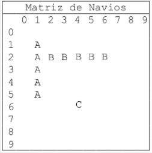
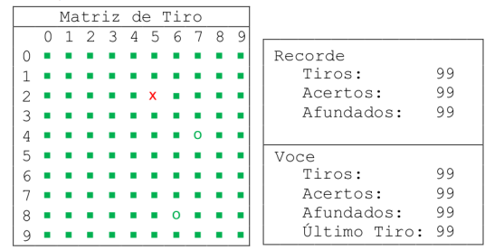

### 1. Problema Apresentado 
<br>

<p>Neste trabalho foi proposto a implementação de um jogo de batalha naval utilizando o conjunto de instruções do processador RISC-V RV32IM, com uma matriz 10 x 10.  Como foi mencionado anteriormente o jogo de batalha naval é um jogo para dois jogadores cujo objetivo é afundar os navios (de diferentes tamanhos) do adversário, os quais são dispostos em uma matriz. Cada linha e coluna da matriz é identificada por um número entre 0 e 9.  Na versão a ser implementada teremos apenas um jogador que fará os disparos contra os navios do inimigo, que será a própria “máquina” ou “sistema”. O programa a ser desenvolvido deverá fazer o controle do jogo e a interface com o usuário.
A cada jogada, uma coordenada (linha e coluna) é fornecida para que o programa verifique e diga se acertou algo. O jogo/rodada termina quando o jogador afunda todas as embarcações presentes na matriz.</p>
<p>Os navios do inimigo estão colocados em uma string chamada “navios” presente na área de dados (.data), que deve ser lida pela função insere_embarcacoes no início do jogo. A string navios possui o seguinte padrão. Na primeira linha é informado o número de navios inseridos. Cada uma das linhas seguintes possui um navio. As linhas que especificam navios possuem 4 valores, separados por um espaço, sendo: o primeiro valor é a disposição do navio sendo, 0 para navio na horizontal e 1 para navio na vertical; o segundo valor é o comprimento do navio; o terceiro valor é a linha inicial do navio e; o quarto valor é a coluna inicial do navio. Observe o Exemplo:</p>

```
3
1 5 1 1
0 5 2 2
0 1 6 4
```
<p>O posicionamento de navios mostrado acima resulta no seguinte posicionamento:</p>



<br>

<p>
A princípio a função insere_embarcacoes deve verificar a validade do posicionamento dos navios, gerando uma mensagem de erro para as seguintes regras que são:
</p>

```
I.	A posição do navio é invalida. Exemplo 0 3 11 7, o erro foi no eixo x da matriz, pois o mesmo é de 10x10.
II.	O navio extrapola as dimensões da matriz. Exemplo 0 4 2 7, o erro foi a quantidade de navios horizontal. 
III.	Ocorre sobreposição dos navios. Exemplo 0 4 2 2e 1 3 0 3, erro quando o mesmo navio ocupa a posição que já esteja ocupada.
```
<p>
Com a partida iniciada, deve ser possível reiniciar o jogo, mostrar o estado atual da matriz de navios e fazer uma nova jogada. Caso queira terminar, poderá finalizar a partida. Entretanto, a interface vai ser exposta no próprio terminal do programa, com a matriz 10x10 gerada e seguindo as regras do posicionamento de cada navio, caso ao contrario emitirá uma mensagem de erro para o usuário arrumar a string de coordenadas.
</p>

<p>
A interface de jogo deve apresentar três grupos de informações: 
</p>

```
I.	A situação atual da matriz de jogo.<br>
II.	A quantidade de tiros já disparados, a quantidade de tiros que acertaram o alvo, a   quantidade de barcos já afundados e a posição do último tiro disparado. <br>
III.	Os recordes do jogo que consiste no menor número de tiros para afundar todas as embarcações de algum jogo anterior. Veja um exemplo:<br>
```
<br>




Voltar para página [anterior](../README.md)   |   [Proxima](solucao.md) página. 