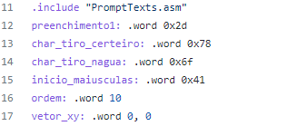
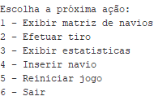

### 2. Solução do desenvolvimento
<br>
<p>
De acordo com o desenvolvimento do programa, foi que separados por etapa são elas como imprimir a matriz, adicionar os navios de vetores, funções de verificações de dados e ainda tendo
informação da linguagem C como base para implementação deste trabalho, pode-se afirmar que foi usado para aperfeiçoar os conhecimentos adquiridos para não houver algum bloqueio de ideia, incluso no projeto ainda tem a pasta de teses que contem conteúdos que foram realizados como base para conclusão do protótipo.
</p>
<p>
A princípio é a tela de configuração é mostrada quando o usuário seleciona a opção jogar no menu inicial. O programa deve apresentar uma matriz de navios (10x10). A matriz deve possuir cada linha e coluna identificada por um “-“ que está em asciz. Podemos ver que temos uma word com dados de informados no problema como direcionamento das embarcações, quantidade e a posição do eixo y, x, sendo lidos quando inicializa o programa, é valido lembrar que código de trabalho foi separados em partes para compressão do programa e visualização do funcionamento do game. Para isso, na main usamos o método include aonde importamos ou melhor usamos os métodos criados para fazer cada função determina e assim realizará seu objetivo. Observe abaixo o jeito que inicializamos um include na main, desta forma:
</p>



<p>
Note que, estamos incluindo o método ‘‘. include "PromptTexts.asm" ’’, que contém strings de interface com o usuário aonde exige a matriz (10x10), e perguntas do tipo aonde o usuário deseja dispara, qual linha e coluna e tendo mensagem de erro caso tenha já atirado em alguma posição da matriz e verificando as posições dos navios se não extrapolam a dimensão do tabuleiro, contendo informações de quantidade de tentativas, tiros, estatísticas e podendo adicionar navios no jogo para entretenimento do jogo.
</p>

<p>
O início de compilação do jogo batalha naval sempre começa com a main, e com isso vai executando cada função exigida pelo include e mostrando a matriz, e o menu com as informações para o usuário jogar. A princípio foi usado o cálculo de para transformar a posição de linha e coluna (L e C) em deslocamento na memória em relação à posição inicial da matriz: 
</p>

```
Deslocamento = (L * QTD_colunas + C) * 4 
Onde: L = linha; C = Coluna; QTD_colunas = quantidade de colunas da matriz constante 4 em função de que cada inteiro ocupa 4 células de memória
```

<p>
Na interação do jogo (a cada jogada) é possível reiniciar o jogo, mostrar o estado atual da matriz de navios e ainda fazer uma nova jogada, com isso temos um menu repleto de funciolidades como verificar aonde está os navios que mostra uma matriz apenas dos navios, informações de total de tiros, acertos e fora (tiro na agua), observo a imagem abaixo do menu:
</p>



<br>

Voltar para página [anterior](problema.md)   |   [Proxima](conclusao.md) página. 